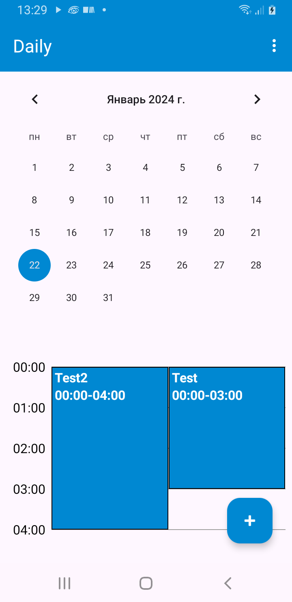
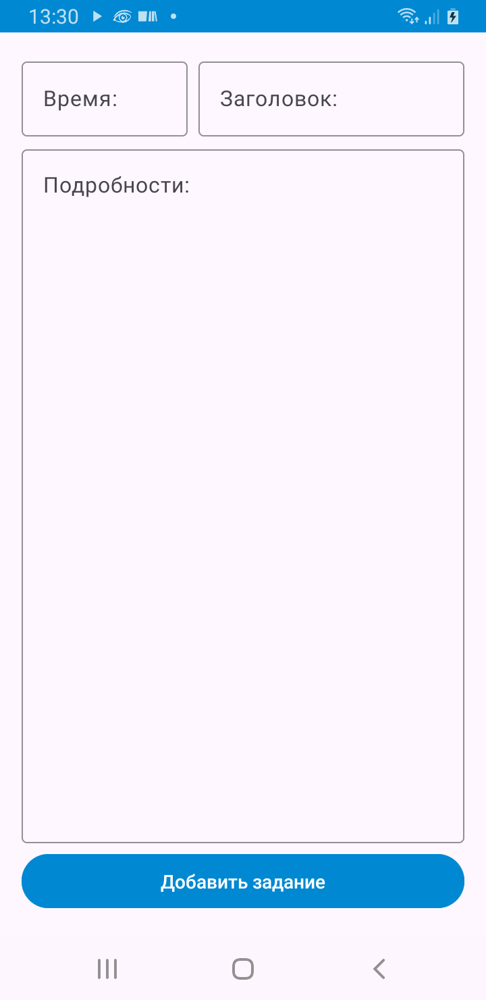
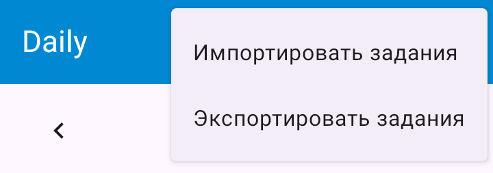

Daily
=
Онлайн-практикум Mobile. Android. Silicium

Android-приложение, которое представляет из себя ежедневник с календарем. В нём можно создавать задания в определенные день и часы, узнать подробную информацию о них, импортировать и экспортировать их в JSON формате.

Внешность
-
|Главный экран| Экран добавления | Возможность посмотреть полную информацию | Возможность экспортировать и импортировать в JSON |
|-|-|-|-|
|||||

Требования
-
### 1й уровень
  - [x] Структурированный чистый код
  - [x] Использование сервисного слоя для подготовки данных
  - [x] Адаптивная верстка с использованием Constraint Layout или сопутствующих технологий в xml разметках
  - [x] Использование архитектурных паттернов
  - [x] Поддержка версий - Android 8+
  - [x] Ориентация - портретная
     
### 2й уровень
  - [+/-] Добавить экран создания дела, на котором присутствуетвозможность указать название, выбрать дату и время, краткоеописание дела текстом
  - [x] Создание компонентов экрана кодом с помощью кастомных вью на Kotlin
  - [x] Для локального хранения используем Room
  - [x] Покрытие Unit-тестами: 1-2 тест

Итог экспорта заданий в JSON
-
```json
[{"id":33,"date_start":1705870800000,"date_finish":1705881600000,"name":"Test","description":"Test details"},{"id":34,"date_start":1705870800000,"date_finish":1705885200000,"name":"Test2","description":"Test2 details"}]
```

Контакты
-
Telegram https://t.me/APRozum
